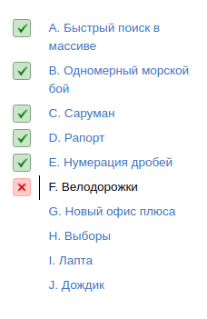

<h1 align="center">
Лекция 4: Бинарный поиск
</h1>

Задал один вопрос и отбросил половину вариантов — звучит, как мечта любого. На этой лекции мечты сбудутся, но не все. Научимся задавать правильные вопросы и поймем, когда это применимо. Насладимся логарифмом вместо линии и решим одним способом много очень разных задач.

Дедлайн 29.03 18:00 по МСК

 

 

